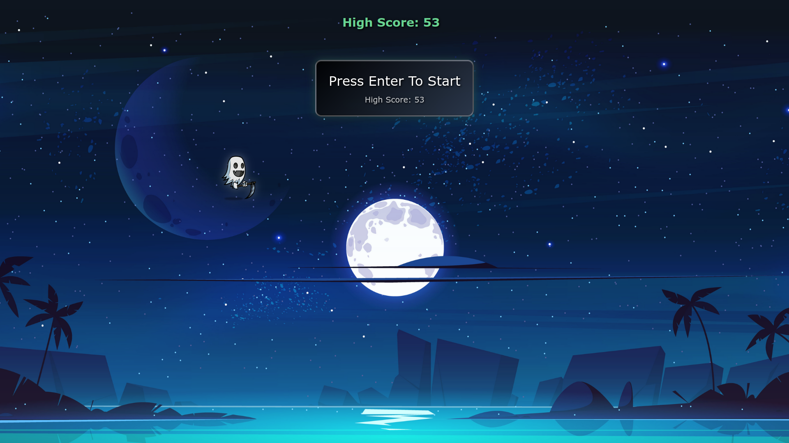
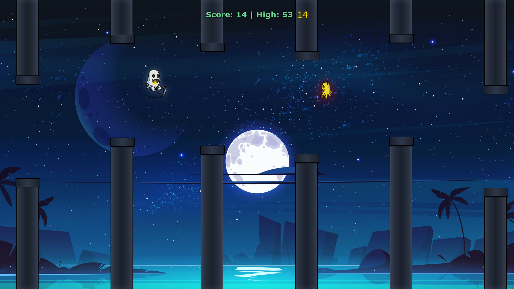
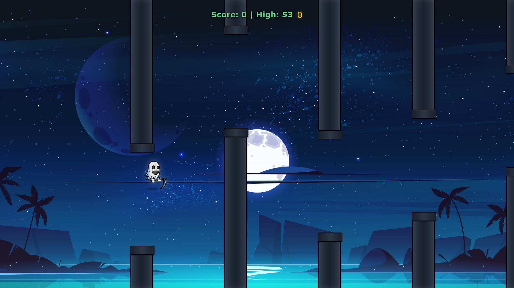
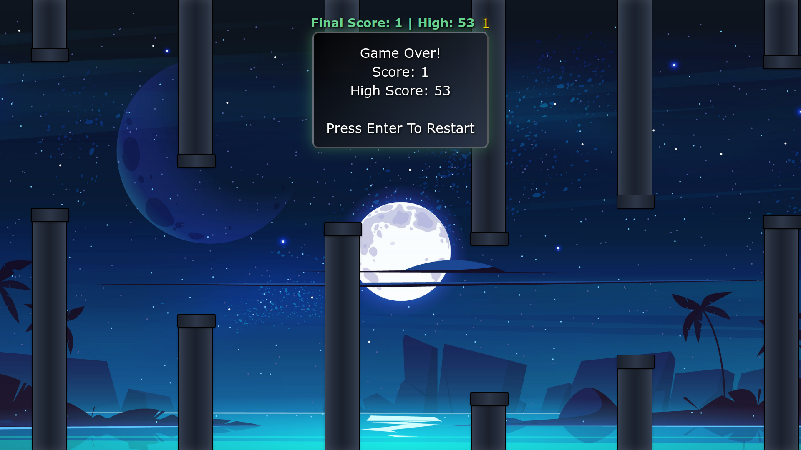
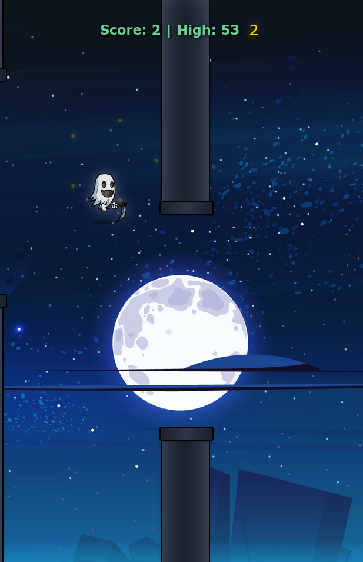

# 🐦 Enhanced Flappy Bird Clone

A modern, feature-rich Flappy Bird clone built with **HTML5**, **SCSS**, and **JavaScript**. This enhanced version includes NPCs, dynamic backgrounds, progressive music system, sound effects, and many other exciting features that elevate the classic gameplay experience.

## 📸 Screenshots

<div align="center">

### 🎮 Game Start Screen


### 🎯 Gameplay with NPCs


### 🏆 Scoring System


### 💀 Game Over Screen


### 📱 Responsive Design


</div>

## 🎮 Game Overview

This Flappy Bird clone reimagines the classic mobile game with enhanced graphics, smooth animations, and progressive gameplay mechanics. Navigate your bird through pipes while encountering various NPCs and experiencing dynamic environmental changes as you progress through different score milestones.

## ✨ Key Features

### 🎯 Core Gameplay
- **Smooth Physics Engine**: Enhanced gravity and jump mechanics for fluid gameplay
- **Progressive Difficulty**: Game speed and challenge increase every 5 points
- **Intelligent Pipe System**: Dynamic pipe spacing and collision detection
- **High Score Persistence**: Your best scores are saved locally
- **Multiple Control Options**: Keyboard and touch controls for all devices

### 🎨 Visual Enhancements
- **Dynamic Backgrounds**: Background changes at scores 50, 200, 500, and 1000
- **NPC Characters**: Four different NPC types that appear based on your score:
  - **Basic NPC** (Score 10+): Standard character
  - **Enhanced NPC** (Score 50+): Improved character design
  - **Rare NPC** (Score 500+): Special rare character
  - **Legendary NPC** (Score 1000+): Ultimate legendary character
- **Modern SCSS Styling**: Beautiful gradients, shadows, and smooth animations
- **Particle Effects**: Golden particles when scoring points
- **Responsive Design**: Optimized for desktop, tablet, and mobile devices

### 🎵 Audio System
- **Dynamic Background Music**: Music changes at different score milestones:
  - Start music (0-199 points)
  - Level 2 music (200-499 points)
  - Level 3 music (500-999 points)
  - Final level music (1000+ points)
- **Sound Effects**: Wing flap, scoring, and death sounds
- **Game Over Music**: Randomized game over tracks
- **Graceful Fallbacks**: Game continues smoothly even if audio files are missing

### 🛠️ Advanced Features
- **Pause/Resume System**: Press 'P' to pause the game anytime
- **Debug Mode**: Press 'D' to visualize collision boxes and performance metrics
- **Performance Monitoring**: Built-in FPS tracking and optimization
- **Modular Architecture**: Clean, maintainable code structure with ES6+ modules
- **Error Handling**: Robust error handling for all game systems

## 🎮 Controls

### Desktop
- **Enter** - Start/Restart game
- **Space** or **Arrow Up** - Jump/Flap
- **P** - Pause/Resume game
- **D** - Toggle debug mode (shows collision boxes)

### Mobile & Touch Devices
- **Tap anywhere** - Jump/Flap or start game
- **Touch-friendly UI** - All interactions optimized for touch

## 🏆 Scoring System

- **1 point** per pipe successfully passed
- **Progressive rewards** unlock new content:
  - **10 points**: NPCs start appearing
  - **50 points**: Enhanced NPCs and background change
  - **200 points**: New music track and background
  - **500 points**: Rare NPCs and advanced music
  - **1000 points**: Legendary NPCs and final music track
- **High score tracking** with local storage persistence
- **Visual feedback** with particle effects and animations

## 🛠️ Technologies Used

- **HTML5** - Game structure and canvas
- **SCSS/CSS3** - Advanced styling with variables, mixins, and animations
- **JavaScript ES6+** - Modern JavaScript with modules, classes, and async/await
- **Web Audio API** - Sound effects and background music system
- **Local Storage API** - High score persistence
- **RequestAnimationFrame** - Smooth 60fps animations

## 📁 Project Structure

```
flappyBirdClone/
├── index.html              # Main HTML file
├── js/                     # JavaScript modules
│   ├── main.js            # Entry point and initialization
│   ├── game.js            # Core game logic and state management
│   ├── config.js          # Game configuration and constants
│   ├── pipe.js            # Pipe generation and collision system
│   ├── npc.js             # NPC character system
│   ├── audio.js           # Sound effects and music management
│   ├── ui.js              # User interface and visual effects
│   ├── input.js           # Input handling (keyboard/touch)
│   └── debug.js           # Debug tools and performance monitoring
├── sass/
│   ├── main.scss          # SCSS source file
│   └── main.css           # Compiled CSS
├── assets/
│   ├── char.png           # Main character sprite
│   ├── kout.png           # Game over sprite
│   ├── bgimg.jpg          # Default background
│   ├── bg-imgs/           # Dynamic background images
│   │   ├── img50.png      # Background for score 50+
│   │   ├── img200.png     # Background for score 200+
│   │   ├── img500.png     # Background for score 500+
│   │   └── img1000.png    # Background for score 1000+
│   ├── npc-char/          # NPC character sprites
│   │   ├── npc1.png       # Basic NPC
│   │   ├── npc-c.png      # Enhanced NPC
│   │   ├── npc-rare.png   # Rare NPC
│   │   └── npc-legendary.png # Legendary NPC
│   ├── music/             # Background music tracks
│   │   ├── fromstartmusic.mp3
│   │   ├── after200.mp3
│   │   ├── after500.mp3
│   │   └── after1000.mp3
│   └── gameOvermusic/     # Game over music
│       ├── gameOver-1.mp3
│       └── gameOver-2.mp3
├── sounds/                # Sound effects
│   ├── point.mp3          # Scoring sound
│   ├── die.mp3            # Death sound
│   └── wing.mp3           # Wing flap sound
└── screenshots/           # Game screenshots
```

## 🚀 Getting Started

1. **Clone or download** this repository
2. **Open `index.html`** in a modern web browser
3. **Press Enter** or **tap the screen** to start playing
4. **Enjoy the enhanced Flappy Bird experience!**

### Development Setup

If you want to modify the SCSS styles:

1. Install a SCSS compiler (like Live Sass Compiler for VS Code)
2. Watch the `sass/main.scss` file for changes
3. The compiled CSS will be automatically generated in `sass/main.css`

## 🎯 Game Configuration

The game is highly customizable through the `GAME_CONFIG` object in `js/config.js`:

```javascript
export const GAME_CONFIG = {
    PIPE_SPEED: 3,                    // Base pipe movement speed
    GRAVITY: 0.5,                     // Gravity strength
    JUMP_FORCE: -7.6,                 // Jump velocity
    PIPE_GAP: 380,                    // Gap between pipes (pixels)
    PIPE_SPAWN_DISTANCE: 350,         // Base distance between pipe spawns
    PIPE_SPAWN_DISTANCE_WITH_NPCS: 450, // Increased distance when NPCs are active
    DIFFICULTY_INCREASE_INTERVAL: 5,   // Points between difficulty increases
    MAX_DIFFICULTY: 2.5,              // Maximum difficulty multiplier
    NPC_SPAWN_SCORES: [10, 50],       // Scores when NPCs start appearing
    MUSIC_CHANGE_SCORES: [200, 500, 1000], // Music transition points
    BG_CHANGE_SCORES: [50, 200, 500, 1000] // Background change points
};
```

## 🐛 Debug Features

Press **'D'** during gameplay to enable debug mode:
- **Red collision box** around the main character
- **Blue collision boxes** around pipes
- **Performance metrics** in the console
- **FPS monitoring** for optimization

## 📱 Mobile Optimization

- **Touch controls** for jumping and game interaction
- **Responsive pipe sizing** that adapts to screen size
- **Optimized font sizes** for different screen resolutions
- **Prevented scrolling** during gameplay for better experience
- **Touch-friendly UI elements** with appropriate sizing

## 🎨 Customization Options

- **Easy sprite replacement** - Simply replace image files in the assets folder
- **Configurable game mechanics** - Modify values in `config.js`
- **SCSS variables** - Customize colors, animations, and effects
- **Modular audio system** - Add or replace sound files easily
- **Extensible NPC system** - Add new NPC types and behaviors

## 🙏 Acknowledgments

This enhanced Flappy Bird clone was developed using:

- **Reference from GeeksforGeeks**: [Flappy Bird Game in JavaScript](https://www.geeksforgeeks.org/javascript/flappy-bird-game-in-javascript/)
- **YouTube Tutorial**: [AutoCodeX Channel](https://youtu.be/Ltg1fl4Obgg?si=3oHSzvu-sLkEnO87)
- **ChatGPT**: Used for assistance with game logic implementation and optimization
- **Original Flappy Bird**: Inspired by the classic mobile game by Dong Nguyen

## 🔧 Browser Compatibility

- **Modern browsers**: Chrome, Firefox, Safari, Edge (latest versions)
- **Mobile browsers**: iOS Safari, Chrome Mobile, Samsung Internet
- **Fallback support**: Graceful degradation for older browsers
- **Audio support**: Web Audio API with fallbacks for unsupported browsers

## 🎯 Future Enhancements

Potential improvements for future versions:
- **Power-ups and special abilities**
- **Multiple character skins and customization**
- **Online leaderboard system**
- **Achievement and trophy system**
- **Parallax scrolling backgrounds**
- **Weather effects and seasonal themes**
- **Multiplayer mode**
- **Sound volume controls**

---

**Enjoy playing the Enhanced Flappy Bird Clone!** 🐦✨

*Built with ❤️ using HTML5, SCSS, and JavaScript*

* play here [Ghosty's Flappy Bird Clone](https://aswin402.github.io/ghosty-flappybirdclone/)